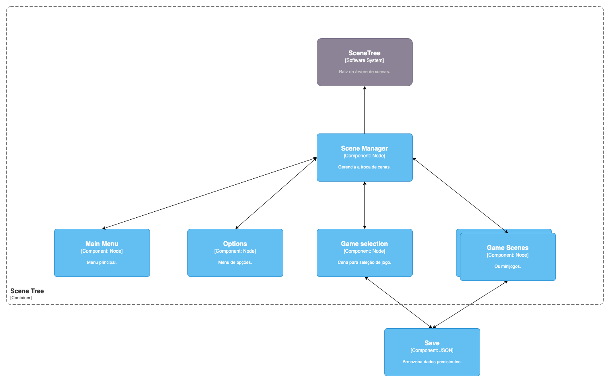

# **Projeto-MC656 \- As Aventuras Ambientais**

# Davi Gabriel Bandeira Coutinho \- 183710

# Márcio Levi Sales Prado \- 183680

# Caio Raphael Teixeira \- 212661

# Gustavo Di Tilia Alves do Amaral \- 218669

# Paulo Bassani \- 185448

**Introdução**  
Esse projeto é uma plataforma de minijogos com a temática de conscientização sobre pautas relevantes que afetam o meio ambiente.

**Arquitetura**  
  
A arquitetura foi inspirada pelo padrão Composite Pattern. Este é o [padrão determinado pela engine (Godot)](https://docs.godotengine.org/en/stable/contributing/development/core_and_modules/godot_architecture_diagram.html). Em nosso projeto, o gerenciador de cenas é um nó que é pai das cenas de tela e é responsável por implementar as transições de cena de forma inteligente que leva em consideração o estado da cena que antecede. Cada uma das cenas de tela é nó de uma subárvore com os elementos daquela cena. Esses contém tudo o que precisam, acessando método externo apenas do gerenciador de cena no momento da transição. O save não é um nó e não faz parte da árvore, ele gerencia os dados persistentes como high scores.