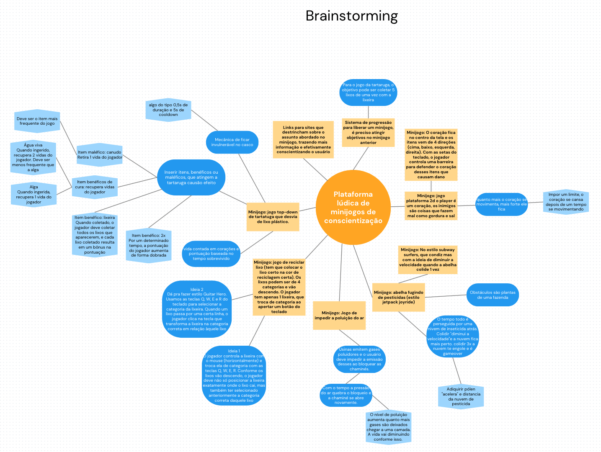

**Requirements Brainstorming**

- Anotar ideias de forma livre no mapa mental  
- Discutir as ideias propostas e sintetizar as divergências  
- Produzir stories a partir do mapa (Nem toda ideia será aproveitada)

[https://www.canva.com/design/DAGTXfEUIwI/ivhpSOGTY5I3ikGN8jIAeg/edit?utm\_content=DAGTXfEUIwI\&utm\_campaign=designshare\&utm\_medium=link2\&utm\_source=sharebutton](https://www.canva.com/design/DAGTXfEUIwI/ivhpSOGTY5I3ikGN8jIAeg/edit?utm_content=DAGTXfEUIwI&utm_campaign=designshare&utm_medium=link2&utm_source=sharebutton)

Legenda:  
Amarelo: Features/Minijogos  
Azul Escuro: Ideias  
Azul Claro: Exemplos/Destalhes de ideias

link para o game design document:  
[https://docs.google.com/document/d/1SQG4Hn\_zHgzMorz4oTWpAsMnulp99CPqYX8RgC5wFEM/edit?usp=sharing](https://docs.google.com/document/d/1SQG4Hn_zHgzMorz4oTWpAsMnulp99CPqYX8RgC5wFEM/edit?usp=sharing)